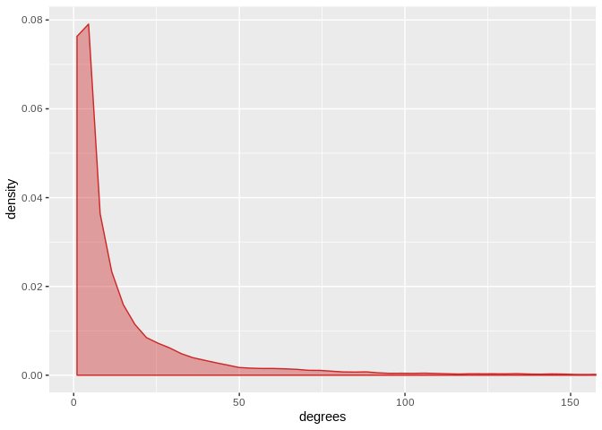
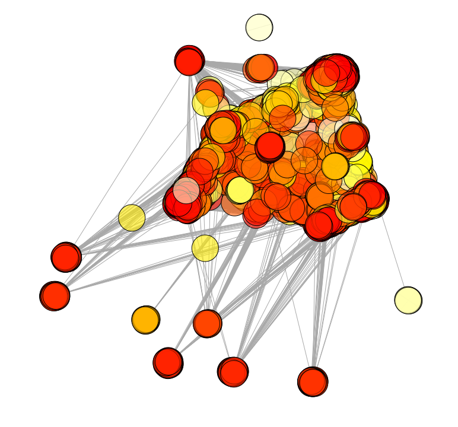

Protein-Protein Interaction Network Community Detection
================

As part of a simple exploratory analysis for this project, I am interested in identifying communities of EBV and KSHV gene targets based on their interaction partners. I am hoping that the community characteristics will yield insights, particularly with the added context of Gene Ontology annotations.

Protein-protein interaction data was initially obtained by downloading BioGRID. After insertion into my database, an edge list was generated using two queries (per virus) to isolate interactions only involving known targets of EBV and KSHV.

These are the queries I used to get all interactions where a target gene was an interactor:

``` sql
\copy (SELECT DISTINCT protein.symbol, protein_interaction.interactor_b_symbol FROM protein, protein_interaction, viral_target, viral_mirna WHERE viral_mirna.virus = 'EBV' AND viral_mirna.vi_mirna_id = viral_target.vi_mirna_id AND viral_target.uniprot_id = protein.uniprot_id AND protein.symbol = protein_interaction.interactor_a_symbol AND protein.symbol != protein_interaction.interactor_b_symbol ORDER BY protein.symbol ASC) to '/media/wkg/storage/db-final-project/data/ebv_target_interactions_a.csv' with csv

\copy (SELECT DISTINCT protein.symbol, protein_interaction.interactor_a_symbol FROM protein, protein_interaction, viral_target, viral_mirna WHERE viral_mirna.virus = 'EBV' AND viral_mirna.vi_mirna_id = viral_target.vi_mirna_id AND viral_target.uniprot_id = protein.uniprot_id AND protein.symbol = protein_interaction.interactor_b_symbol AND protein.symbol != protein_interaction.interactor_a_symbol ORDER BY protein.symbol ASC) to '/media/wkg/storage/db-final-project/data/ebv_target_interactions_b.csv' with csv
```

I then used a bash script to combine the two files:

``` bash
cat ./data/ebv_target_interactions_a.csv ./data/ebv_target_interactions_b.csv > ./data/ebv_target_interactions.csv
rm ./data/ebv_target_interactions_a.csv
rm ./data/ebv_target_interactions_b.csv
```

Community detection, plotting, and other graph functions were all done using the igraph package.

First, let's look at a density plot of node degrees:

``` r
# get node degrees
degrees <- degree(graph)
degrees <- as.data.frame(degrees)
ggplot(degrees, aes(degrees)) + geom_density(color="firebrick3", fill="firebrick3", alpha=0.4) + coord_cartesian(xlim=c(0,150))
```



Not suprisingly, the degree distribution is highly skewed, characteristic of a scale-free network. This may also be somewhat due to scientific focus on studying certain genes. For example, the top few genes with the most interaction partners are:

``` r
temp_df <- data.frame(rownames(degrees), c(degrees$degrees))
names(temp_df) <- c("Gene", "Degree")
temp_df <- temp_df[order(-temp_df$Degree),]
#degrees <- degrees[order(-degrees$degrees),]
knitr::kable(head(temp_df, n=10), row.names=FALSE)
```

| Gene   |  Degree|
|:-------|-------:|
| ELAVL1 |    1787|
| XPO1   |    1263|
| BRCA1  |    1002|
| MCM2   |     952|
| TNIP2  |     897|
| RNF2   |     736|
| CDK2   |     690|
| EWSR1  |     670|
| MYC    |     665|
| CHD4   |     644|

Next, community membership is decided using the infomap algorithm:

``` r
communities <- cluster_infomap(graph, nb.trials=10)
length(communities)
```

    ## [1] 600

``` r
V(graph)$community <- communities$membership
colors <- palette(terrain.colors(length(communities), alpha=.6))
plot(graph, vertex.color=colors[V(graph)$community], vertex.label=NA)
```


