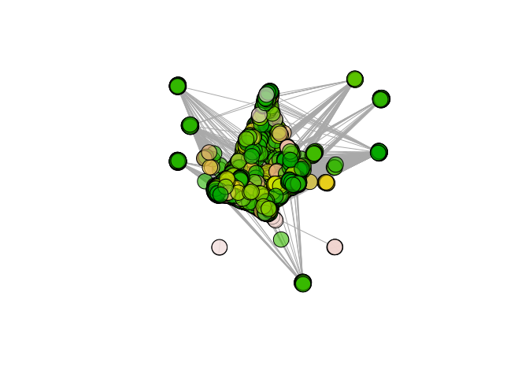
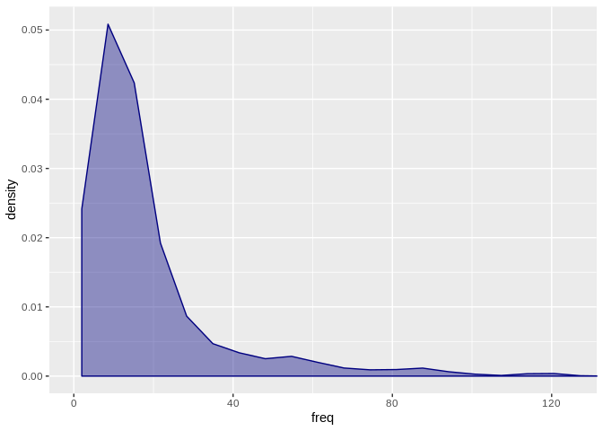
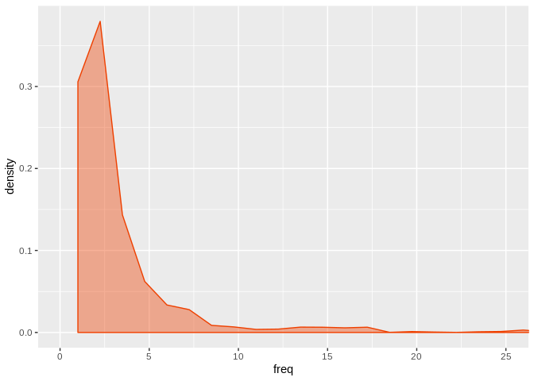
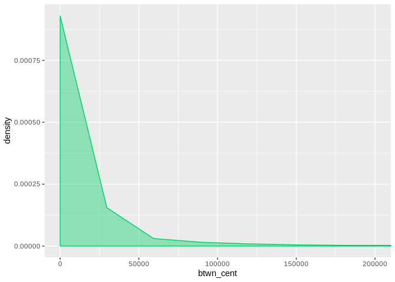

EBV and KSHV Target Gene Network Analysis
================

As part of a simple exploratory analysis for this project, I am
interested in identifying communities of EBV and KSHV gene targets based
on their interaction partners. I am hoping that the community
characteristics will yield insights, particularly with the added context
of Gene Ontology annotations.

Protein-protein interaction data was initially obtained by downloading
BioGRID. After insertion into my database, an edge list was generated
using two queries (per virus) to isolate interactions only involving
known targets of EBV and KSHV.

These are the queries I used to get all interactions where a target gene
was an interactor:

``` sql
CREATE TEMP VIEW temp_view AS
SELECT DISTINCT protein.symbol, protein_interaction.interactor_b_symbol 
FROM protein, protein_interaction, viral_target, viral_mirna 
WHERE viral_mirna.virus = 'EBV' AND viral_mirna.vi_mirna_id = viral_target.vi_mirna_id 
AND viral_target.uniprot_id = protein.uniprot_id 
AND protein.symbol = protein_interaction.interactor_a_symbol 
AND protein.symbol != protein_interaction.interactor_b_symbol ORDER BY protein.symbol ASC;

\copy (SELECT * FROM temp_view) to '/media/wkg/storage/db-final-project/data/ebv_target_interactions_a.csv' with csv
DROP VIEW temp_view;

CREATE TEMP VIEW temp_view AS
SELECT DISTINCT protein.symbol, protein_interaction.interactor_a_symbol 
FROM protein, protein_interaction, viral_target, viral_mirna 
WHERE viral_mirna.virus = 'EBV' AND viral_mirna.vi_mirna_id = viral_target.vi_mirna_id 
AND viral_target.uniprot_id = protein.uniprot_id 
AND protein.symbol = protein_interaction.interactor_b_symbol 
AND protein.symbol != protein_interaction.interactor_a_symbol ORDER BY protein.symbol ASC;

\copy (SELECT * FROM temp_view) to '/media/wkg/storage/db-final-project/data/ebv_target_interactions_b.csv' with csv
DROP VIEW temp_view;
```

I then used a bash script to combine the two
files:

``` bash
cat ./data/ebv_target_interactions_a.csv ./data/ebv_target_interactions_b.csv > ./data/ebv_target_interactions.csv
rm ./data/ebv_target_interactions_a.csv
rm ./data/ebv_target_interactions_b.csv
```

Community detection, plotting, and other graph functions were all done
using the igraph package. igraph is available for both R and Python

First, let’s look at a density plot of node degrees:

``` r
# get node degrees
degree <- degree(graph)
degree <- as.data.frame(degree)
ggplot(degree, aes(degree)) + geom_density(color="firebrick3", fill="firebrick3", alpha=0.4) + coord_cartesian(xlim=c(0,150))
```

<!-- -->

Not suprisingly, the degree distribution is highly skewed,
characteristic of a scale-free network. This may also be somewhat due to
scientific focus on studying certain genes. For example, the top few
genes with the most interaction partners are:

``` r
temp_df <- data.frame(rownames(degree), c(degree$degree))
names(temp_df) <- c("gene", "degree")
temp_df <- temp_df[order(-temp_df$degree),]
knitr::kable(head(temp_df, n=10), row.names=FALSE)
```

| gene   | degree |
| :----- | -----: |
| ELAVL1 |   1787 |
| XPO1   |   1263 |
| BRCA1  |   1002 |
| MCM2   |    952 |
| TNIP2  |    897 |
| RNF2   |    736 |
| CDK2   |    690 |
| EWSR1  |    670 |
| MYC    |    665 |
| CHD4   |    644 |

Next, community membership is decided using the infomap algorithm:

``` r
set.seed(42)
communities <- cluster_infomap(graph, nb.trials=10)
membership <- cbind(V(graph)$name, communities$membership)
membership <- as.data.frame(membership)
names(membership) <- c("symbol", "community")

# Write membership to output
write.csv(membership, "./data/protein_community_membership.csv", row.names=FALSE, quote=FALSE)

# Check number of communities
length(communities)
```

    ## [1] 590

``` r
V(graph)$community <- communities$membership
plot(graph, vertex.color=colors[V(graph)$community], vertex.label=NA)
```

<!-- -->

Let’s look at the distribution of proteins across communities:

``` r
counts = as.data.frame(count(membership, "community"))
ggplot(counts, aes(freq)) + geom_density(color="navy", fill="navy", alpha =0.4) + coord_cartesian(xlim=c(0,125))
```

<!-- -->

This doesn’t seem like a terrible distribution, as we can see in the
table below we definitely have some larger, outlier communities, but
most of the communities are smaller.

``` r
sorted_counts = counts[with(counts, order(-freq)),]
knitr::kable(head(sorted_counts, n=10), row.names=FALSE)
```

| community | freq |
| :-------- | ---: |
| 1         | 3367 |
| 2         |  331 |
| 4         |  286 |
| 3         |  233 |
| 12        |  222 |
| 14        |  202 |
| 8         |  195 |
| 5         |  187 |
| 9         |  171 |
| 7         |  169 |

I am primarily interested in the community identities of EBV targets, so
I will subset my data frame to only include these proteins. First, I
query Postgre to get the data:

``` sql
CREATE TEMP VIEW temp_view AS
SELECT DISTINCT protein.symbol 
FROM protein, viral_target, viral_mirna 
WHERE viral_mirna.virus = 'EBV' AND viral_mirna.vi_mirna_id = viral_target.vi_mirna_id 
AND viral_target.uniprot_id = protein.uniprot_id ORDER BY protein.symbol ASC;

\copy (SELECT * FROM temp_view) to '/media/wkg/storage/db-final-project/data/ebv_target_symbols.csv' with csv
DROP VIEW temp_view;
```

``` r
ebv_targets <- read.csv("./data/ebv_target_symbols.csv", header=FALSE)
names(ebv_targets) <- "symbol"
ebv_targets <- merge(ebv_targets, membership, by="symbol")

# Merge membership df to ebv_targets by symbol
```

Now let’s look at the distribution of community sizes and a top ten
table just for EBV targets:

``` r
counts_subset = as.data.frame(count(ebv_targets, "community"))
ggplot(counts_subset, aes(freq)) + geom_density(color="orangered2", fill="orangered2", alpha =0.4) + coord_cartesian(xlim=c(0,25))
```

<!-- -->

``` r
sorted_counts = counts_subset[with(counts_subset, order(-freq)),]
knitr::kable(head(sorted_counts, n=10), row.names=FALSE)
```

| community | freq |
| :-------- | ---: |
| 1         |  639 |
| 4         |   88 |
| 3         |   37 |
| 5         |   33 |
| 8         |   31 |
| 6         |   29 |
| 11        |   28 |
| 13        |   26 |
| 2         |   26 |
| 9         |   24 |

This is my first experience examining protein-protein interaction
networks, so I am not entirely sure what the best way is to evaluate the
performance of the community detection algorithm. As a start though, I
am going to look igraph also has a function for getting estimating the
betweenness centrality of nodes and edges. Betweenness centrality
describes the number of shortest paths that exist through a node, so
these nodes may be more likely to be
influential.

``` r
#btwn_cent <- estimate_betweenness(graph, directed=FALSE, weight=NULL, cutoff=-1)
btwn_cent <- betweenness(graph, directed=FALSE, weight=NULL)
btwn_cent <- as.data.frame(btwn_cent)
ggplot(btwn_cent, aes(btwn_cent)) + geom_density(color="springgreen3", fill="springgreen3", alpha=0.4) + coord_cartesian(xlim=c(0,200000))
```

<!-- -->

Let’s look at the ten largest nodes by betweenness centrality:

``` r
temp_df_2 <- data.frame(rownames(btwn_cent), c(btwn_cent$btwn_cent))
names(temp_df_2) <- c("gene", "betweenness")
net_stats <- merge(temp_df_2, temp_df, by="gene")
net_stats <- net_stats[order(-net_stats$betweenness),]
knitr::kable(head(net_stats, n=10), row.names=FALSE)
```

| gene   | betweenness | degree |
| :----- | ----------: | -----: |
| ELAVL1 |    15169478 |   1787 |
| XPO1   |     6441951 |   1263 |
| TNIP2  |     3733686 |    897 |
| BRCA1  |     3726502 |   1002 |
| MCM2   |     3588951 |    952 |
| TRIM25 |     3144125 |    576 |
| KRAS   |     2867622 |    597 |
| EWSR1  |     2731981 |    670 |
| ESR2   |     2427130 |    581 |
| MYC    |     2320465 |    665 |

Not surprisingly, many of the high degree nodes also have high
betweenness centralities, however there are a few that were not in the
top ten for degree: KRAS, TRIM25, and ESR2. Likewise, RNF2, CDK2, and
CHD4 had high degrees but are not in the top ten for betweenness
centrality.

We can subset the data frame to quickly see the betweenness values for
RNF2, CDK2, and
CHD4:

``` r
subset <- net_stats[which(net_stats$gene %in% c("RNF2", "CDK2", "CHD4")),]
subset <- subset[order(-subset$degree),]
knitr::kable(head(subset), row.names=FALSE)
```

| gene | betweenness | degree |
| :--- | ----------: | -----: |
| RNF2 |     1972777 |    736 |
| CDK2 |     1622640 |    690 |
| CHD4 |     1165910 |    644 |
